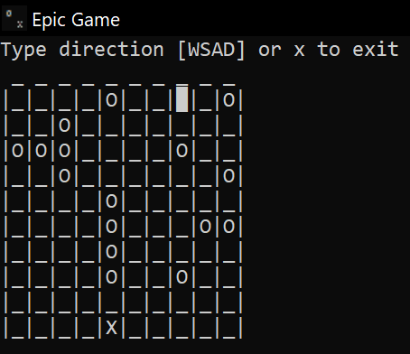
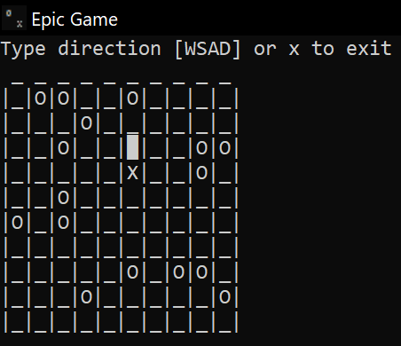
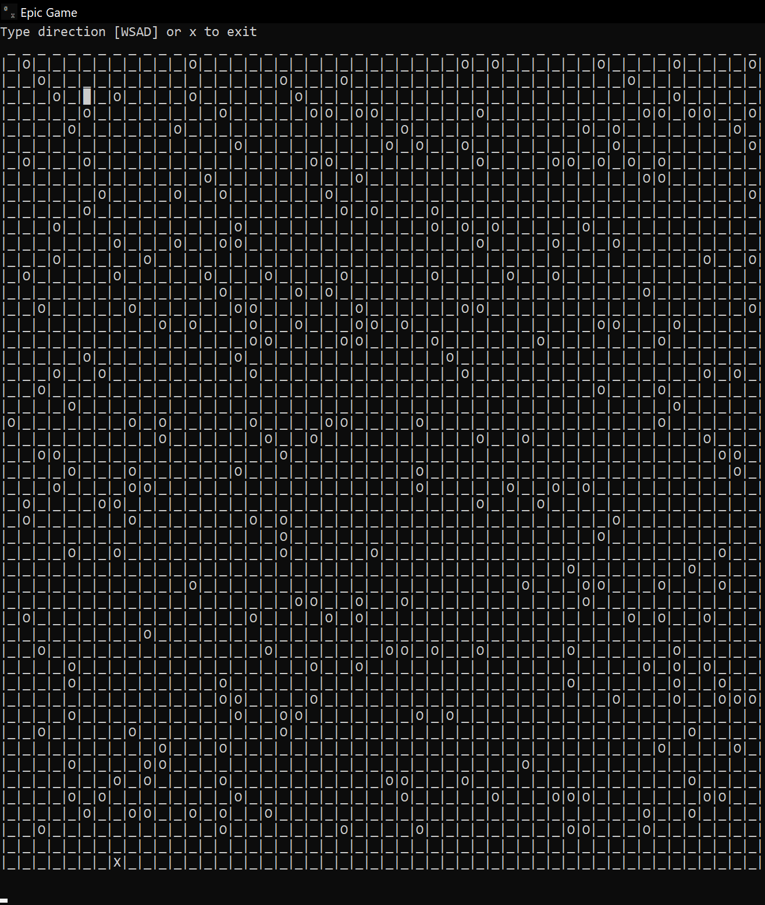
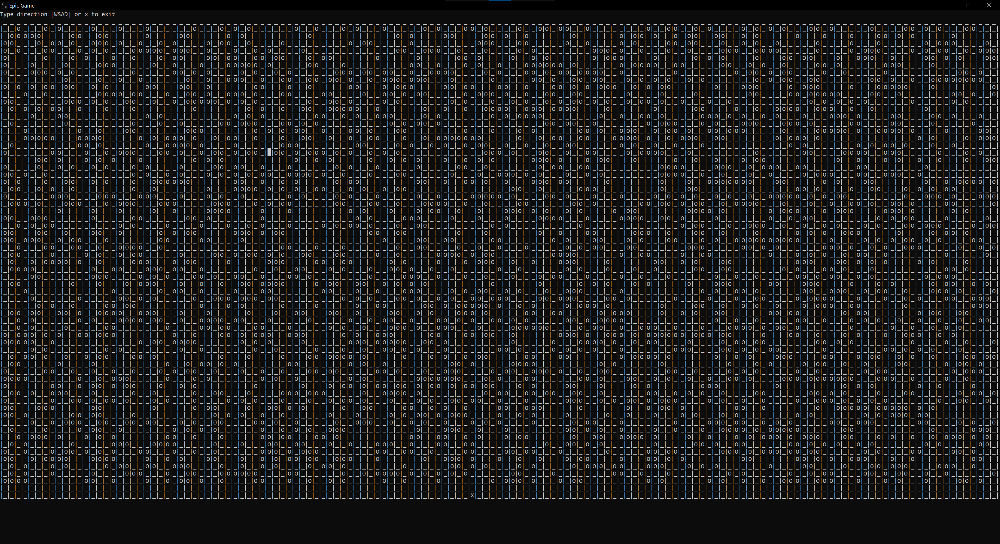

# Epic Game

## Description
The most epic terminal game you have ever played!!!

Written in `C++` for Windows.

It was written as a personal project at the end and immediately after the last year of high school.

## Getting started
You can install the game using one of the available [installers](https://github.com/Bastillan/Epic-Game/releases/latest) or build it from source, for example using Visual Studio.

## Gameplay
It is a type of evasion game. Player **X** has to evade enemies **O** and try to catch objective **█**.

Player controls with WSAD keys.

All players (user-controlled and computer-controlled) move simultaneously in each turn. Computer-controlled players move randomly, but cannot enter the same field at the same time. If they cannot make a move they remain in place.

There are two game modes:
- Standard
- Persuit

In the last one the objective **█** is also moving.

There are three levels of difficulty:
- Easy (enemies occupy 1/9 of the map)
- Normal (enemies occupy 1/6 of the map)
- Difficult (enemies occupy 1/3 of the map)

Player can also choose the size of the map from a range adjusted to the maximum size of the console.

### Some screenshots

